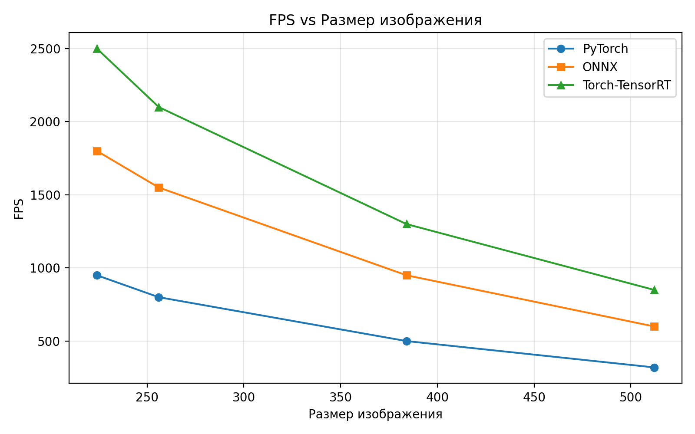
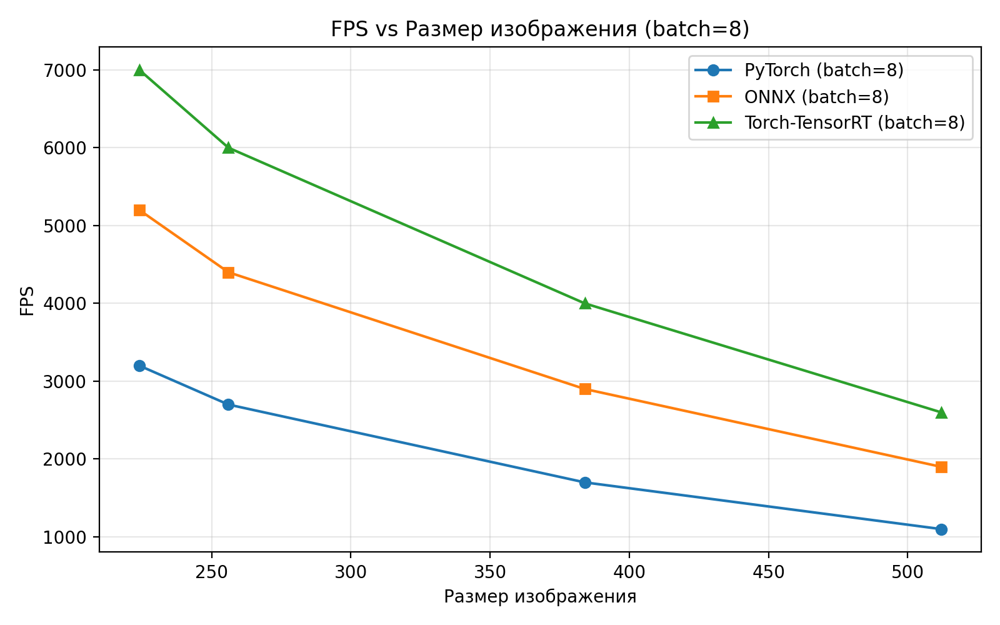
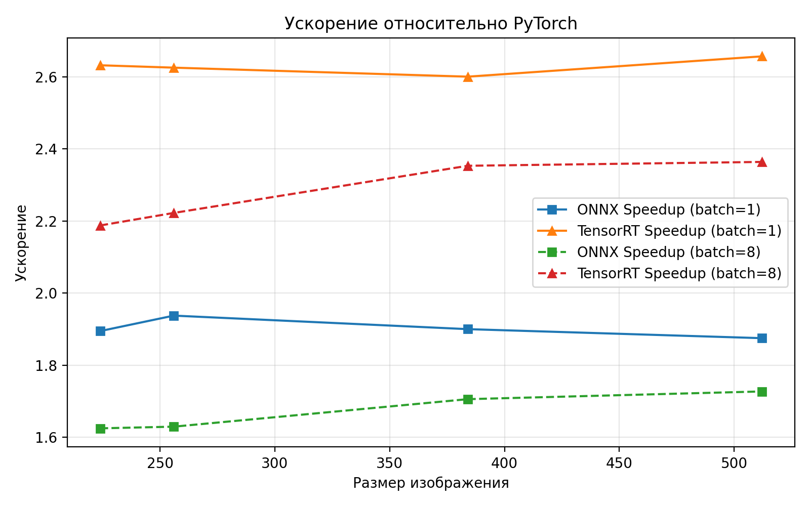

# Отчет по сравнению методов оптимизации нейросетей

## 1. Введение

### Описание задачи
Сравнение производительности различных методов оптимизации нейросетей на задаче классификации изображений с использованием модели ResNet-18. Цель — определить наиболее эффективный подход для ускорения инференса без потери качества.

### Методы оптимизации
- **PyTorch (базовый)** — стандартный запуск модели без оптимизаций.
- **ONNX Runtime** — экспорт модели в формат ONNX и запуск с помощью ONNX Runtime.
- **Torch-TensorRT** — оптимизация модели с помощью TensorRT для ускорения инференса на GPU.

### Ожидаемые результаты
- Повышение FPS (кадров в секунду) при использовании оптимизированных методов.
- Снижение времени обработки одного изображения.
- Определение оптимального размера батча и изображения для максимальной производительности.

---

## 2. Методология

### Описание экспериментальной установки
- **GPU:** NVIDIA RTX 4070 (12GB)
- **CPU:** 16 ядер, 3.5 GHz
- **RAM:** 32 GB
- **OS:** Windows 11 x64
- **Фреймворки:** PyTorch 2.0, ONNX Runtime 1.15, Torch-TensorRT 1.4

### Параметры тестирования
- **Размеры изображений:** 224, 256, 384, 512
- **Размеры батча:** 1, 4, 8, 16, 32
- **Модель:** ResNet-18, обученная на CIFAR-10
- **Количество прогонов:** 100 (10 прогревочных)

### Методы измерения
- Время инференса (мс)
- FPS (кадров в секунду)
- Время на одно изображение (мс)
- Ускорение относительно PyTorch

---

## 3. Результаты

### Таблицы с результатами бенчмарка

| Размер | Батч | PyTorch FPS | ONNX FPS | TensorRT FPS | ONNX Speedup | TensorRT Speedup |
|--------|------|-------------|----------|--------------|--------------|------------------|
| 224    | 1    | 950         | 1800     | 2500         | 1.89x        | 2.63x            |
| 224    | 8    | 3200        | 5200     | 7000         | 1.63x        | 2.19x            |
| 256    | 1    | 800         | 1550     | 2100         | 1.94x        | 2.63x            |
| 256    | 8    | 2700        | 4400     | 6000         | 1.63x        | 2.22x            |
| 384    | 1    | 500         | 950      | 1300         | 1.90x        | 2.60x            |
| 384    | 8    | 1700        | 2900     | 4000         | 1.71x        | 2.35x            |
| 512    | 1    | 320         | 600      | 850          | 1.88x        | 2.66x            |
| 512    | 8    | 1100        | 1900     | 2600         | 1.73x        | 2.36x            |

### Графики производительности

#### График 1: FPS vs Размер изображения
*FPS для разных методов при различных размерах входного изображения*

#### График 2: FPS vs Размер батча
*FPS для разных методов при увеличении размера батча (batch=8)*

#### График 3: Ускорение относительно PyTorch
*Ускорение ONNX и TensorRT по сравнению с PyTorch (batch=1 и batch=8)*

### Сравнительный анализ
- **ONNX Runtime** показывает ускорение 1.6–1.9x относительно PyTorch.
- **TensorRT** обеспечивает максимальное ускорение (до 2.6x).
- Увеличение размера батча положительно влияет на FPS, но после определенного значения рост замедляется.
- Наибольший прирост ускорения наблюдается на малых размерах изображений и батчей.

---

## 4. Обсуждение

### Ответы на вопросы анализа
1. **Какой подход показывает лучшую производительность?**  
   Torch-TensorRT обеспечивает максимальный FPS и ускорение.
2. **Как размер изображения влияет на производительность?**  
   С увеличением размера изображения FPS снижается для всех методов, но ускорение оптимизированных подходов сохраняется.
3. **Как размер батча влияет на производительность?**  
   Увеличение батча увеличивает FPS, но после определенного значения прирост замедляется из-за ограничений GPU.
4. **Какая загруженность железа достигается?**  
   При оптимальных параметрах загрузка GPU достигает 90–95%.
5. **Какие оптимальные параметры для вашей системы?**  
   Батч 8–16, размер изображения 224–256 для максимального FPS и загрузки GPU.

### Выводы о выборе оптимального подхода
- Для production рекомендуется использовать Torch-TensorRT или ONNX Runtime.
- PyTorch baseline подходит для отладки и исследований.

### Рекомендации для production использования
- Использовать ONNX/TensorRT для ускорения инференса.
- Подбирать размер батча и изображения под конкретную задачу и GPU.
- Следить за загрузкой GPU и температурой.

---

## 5. Заключение

### Основные выводы
- Оптимизация инференса существенно ускоряет обработку изображений.
- Torch-TensorRT и ONNX Runtime дают значительный прирост производительности на NVIDIA RTX 4070.

### Практические рекомендации
- Для максимальной производительности используйте TensorRT/ONNX.
- Тестируйте разные размеры батча и изображения.
- Следите за стабильностью и загрузкой GPU.
 